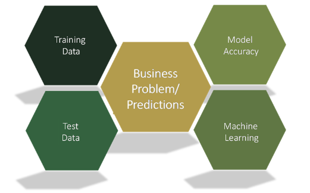

# **[Machine Learning Ramp Up Guide: Summary](https://training.resources.awscloud.com/get-certified-machine-learning-specialty/aws-ramp-up-guide-machine-learning-2)**

## **Step 1: Learn AWS Machine Learning (ML) fundamentals**

### a) Machine Learning Essentials for Business and Technical Decision Makers

### **Introduction to Machine Learning: Art of the Possible**

 

- ML &rarr; using math to find patterns in data & update model and training data to improve accuracy.

   

  - Key Terms (M.T.T.D):
  
    **Model** &rarr; The output of an ML algorithm trained on a data set; used for data prediction.

    **Training** &rarr; The act of creating a model from past data.

    **Testing** &rarr; Measuring the performance of a model on test data.

    **Deploying** &rarr; Integrating a model into a production pipeline.

     

  - History of Amazon and ML:

**Amazon Flywheel** - How investing in specific key business operations can reinforce other processes and create a positive feedback loop.

**AWS ML Flywheel** - Uses data collected from parts of a business operation, a model to predict future outcomes, and provides ways to continuously improve efficiency.

**Amazon uses ML in the following ways:**

- Product recommendations and promotions.

- Alexa and voice interactions through NLP.

- Ship 1.6M packages per day.

**Amazon AI/ML Services:**

- Amazon Forecast: Time series forecasting (just upload data within requirements).

- Amazon Fraud Detector: Fully managed service that spots online payment fraud and creation of fake accounts.

- Amazon Personalize: Recommender where you select a training algorithm to use on the data, solution model training, and solution deployment.

- Amazon Polly: Text to speech.

- Amazon Transcribe: Speech to text (Polly's opposite).

- Amazon SageMaker: Think of Jupyter lab on steroids.

 

### **How does machine learning work?**

- **AI**: Automate and accelerate tasks performable by humans through natural intelligence. Two types:

  - **Narrow** &rarr; AI imitates human intelligence in a single context.

  - **General** &rarr; AI learns and behaves with intelligence across multiple contexts.

- **ML vs AI: Difference**: AI ingests data and imitates human knowledge vs ML improves model on training data (subset)

- **ML vs Traditional Programming**: ML is teaching a computer to recognize patterns by example, rather than programming it with specific rules.

- **3 Main ML Categories:**

  - **Supervised learning** &rarr; model learns from a data set containing input values and paired output values that you would like to predict. Could be *classification* (spam detection) or *regression* (forecasting demand).

     

  

  - **Unsupervised learning** &rarr; training model learns from data without any guidance. The objective is pattern and structure recognition. Could be *clustering* (customer segmentation) or *association* (finding regularities among products).

  

  - **Reinforcement learning** &rarr; training model learns from its environment by being rewarded for correct moves and punished for incorrect moves. F.ex *autonomous driving*.

  

 

### **What are some potential problems with machine learning?**

- Basically a combination of:

  - Poor Data / Lack of data.

  - Unexplainability (Too complex). Or too simplistic (low accuracy).

  - Take uncertainty (black swan events into account).

 

### **Planning a Machine Learning Project**

- Is a machine learning solution appropriate for my problem?

  - Requires 4 main components:

    - **Complex logic** (f.ex recommender).

    - **Requires scalability** (f.ex personalized recommendations to million users).

    - **Requires personalization** (tailored specific to user).

    - **Requires responsiveness** (response in milliseconds to personalization).

  - We dont need to use ML if:

    - Can be solved with traditional algorithms.

    - Does not require adapting to new data.

    - Requires 100% accuracy.

    - Requires full interpretability.

- Is my data ready for machine learning?

  - Types of data:

    - Document

    - Audio

    - Images

    - Video

- Checklist requirement for using data:

  - **Availability** (not requiring significant preprocessing). &check;

  - **Accessibility** (on demand with CRUD capabilities). &check;

  - **Respect Privacy** (f.ex ethnicity, salary). &check;

  - **Security** (f.ex respect regulations). &check;

  - **Relevant** to the scope an project. &check;

  - **Fresh** and recent data. &check;

  - **Representative** and encompassing features. &check;

  - **Unbiased** without agenda. &check;

 

### **How will machine learning impact a project timeline?**

- Machine learning project expectations (weeks up to months). Keep track of model drift (changes in data distribution)!

- A typical timeline for ML projects (rough benchmark).

 

### **What early questions should I ask in deployment?**

- What is the likely computational cost of generating predictions with your model?

- How quickly does your data change?

- How significant are the changes needed to deploy?

- Does the model’s performance meet the business need?

 

### **Building a Machine Learning Ready Organization**

- How can I prepare my organization for using ML?

  - Have a robust ML strategy.

  - Data strategy.

  - Culture of learning and collaboration.

  - Find the right problem (data, complexity, ).

  - Fail forward (deliberate failure - keep experimenting).

  - Scale beyond proofs of concept (POC).

   

### **Machine Learning for Business Challenges**

- Key Takeaways:

  - Defining **scope** of ML problem:

    - Specific business problem we are trying to solve.

    - Current state.

    - What are / what is causing pain points.

    - Impact of the problem.

    - How do we define success.

  - **Input** gathering:

    - Do we have sufficient data?

    - Is there labeled data?

    - How difficult to obtain labeled data?

    - What are the main features?

    - Where is data located?

    - Data quality check?

  - **Output** definitions:

    - What business metrics define success?

    - Trade-offs?

    - Existing baselines (if not, simplest solution)?

    - How important is runtime and performance?

- Image **Classification** Problem:

  - We need training data, and groundtruth label.

  - Feature engineering: deciding set of measurements for each instance.

  - Choose classifier model (select the one with higher accuracy on *validation* set and ***good business values***):

    - **SVM** (creates a line which separates the data into classes).

    - **Naive Bayes** (uses Bayes rule together with a strong assumption that the attributes are conditionally independent).

    - **Logistic Regression** (predicts the probability of a binary (yes/no) event).

    - **Deep Neural Networks**

 

- **Reinforcement** Problem: Training a Robot

  - Reward / Punish agent based on choice and reiterate.

  - No presentation of input or output pairs.

  - Agent needs to gather useful experiences.

  - Evaluation is often concurrent with learning.

   

- **Automating Speech Tasks** Problem: Pollexy

  - Speech to task and automation.

   

### **Machine Learning Terminology and Process**

- **Step 1: Business Problem**

  - What are we trying to solve (see scope,input and output above).

   

- **Step 2: Machine Learning Problem**

  - What model could solve most of our issues.

  - Key Elements:

    - Attributes from dataset &rarr; **Observations**

    - Future Outputs &rarr; **Labels**

    - Used attributes to predict labels &rarr; **features**

  - Framing ML problem:

  - 

- **Step 3: Develop Datasets**

  - Data collection and integration

  - 3 different types:

    - **Structured** (Organized in tabular/databases)

    - **Semi-Structured** (semi - csv, json)

    - **Unstructured** (video, image etc.)

- **Step 4: Data Preparation**

  - Data Cleaning:

    - Could introduce new variable

    - Remove

    - Or Imputation (best guess)

  - Imputation:

    - You can refer here for a comprehensive review of the [**best imputation methods**](https://www.kaggle.com/discussions/general/375794).

     

  - Data Shuffling:

    - We dont want to make predictions just based on order (could lead to bias) - so we shuffle.

  - Test/Val/Train Split:

    - Predict new examples (by holding from our dataset).

    - Train ~ 70% of data.

    - Test ~ 20% of data.

    - Validation ~ 10% of data.

     

  - Cross Validation Techniques:

    - Leave-One-Out (Only use one data point as our test sample, run training with other examples) - Expensive

    - K-Fold (For each fold we train the model and keep track of error).

     

- **Step 5: Data Visualization and Analysis**

  - **Feature** = Attribute in training dataset.

  - **Label** = NOT in training; what we are trying to predict.

  - Types of Visualization for EDA:

    - Statistics

    - Scatterplots

    - Histograms

  - Features and Target Summary:

    - Numerical & Categorical.

    - Usually check distributions / detect outliers through histograms.

    - Check correlation through scatterplots.

    

- **Step 6: Feature Engineering**

  - Converts raw data into a higher representation of the data.

  - F.ex moving from non-linearity to linear models.

    - Numeric value binning in to groups (age, salaries etc.)

    - Quadratic features (combining them together).

    - Non/Linear Feature Transformations (log, product/ratio, tree-path).

    - Domain specific transformation (text/image/web based).

    

- **Step 7: Model Training**

  - Parameters &rarr; tune model to improve performance.

  - **Loss Function** (Calculates how far predictions are from ground truth):

    - **Square** (regression, classification).

    - **Hinge** (classification, best for outliers).

    - **Logistic** (classification, best for skewed data).

  - **Regularization** (Can increase generalization of the model to better fit the data):

    - Prevents overfitting by contraining weights to be too small.

  - **Learning Parameters/Decay Rate** (controls how fast our model learns):

    - Decaying too aggressively (algorithm never reaches the optimum).

    - Decaying too slowly (algorithm bounces around / never converging to an optimum).

 

- **Step 8: Model Evaluation**

  - Dont fit training data to obtain maximum accuracy.

    - Overfitting vs Underfitting.

    

  - Bias vs Variance:

    - **Bias**: Difference between average model prediction to target values.

    - **Variance**: Variation in prediction of different models.

- **Evaluation Metrics:**

  - For **regression**:

    - Root Mean Square Error **(RMSE)** - lower is better (use only in test)

    - Mean Absolute Percetage Error **(MAPE)** - lower is better (use only in test)

    - R Squared $(R^2)$ - How much better the is the model compared to picking best constant? **(1 - Model MSE / Variance)**

  - For **classification**:

- Confusion Matrix:

  - 

  - How many data points were classified correctly and incorrectly.

    - ROC Curve - For binary classification prediction.

    - **Precision** (How correct under the positive predictions).

      - F.ex - In search engine - (Precision is quality of viewed / relevance)

    - **Recall** (Fraction of the negatives that were wrongly predicted)

      - F.ex - In search engine - (Recall is completeness of results, and what fraction of relevancy was found).

   

- **Step 9: Business Goal Evaluation**

  - Do we need data or feature **augmentation** ?

  - Evaluate how model is performing related to business goals:

    - Accuracy of the model.

    - Interpretability.

    - Model generalization on unseen/unknown data.

    - Business success criteria (KPIs).

 

 

---

## **Step 2.1: Learn Data Platform Engineering on AWS**

### **Machine Learning Security**

### a) AWS Security Fundamentals

- Cloud security principles:

  - **Implement a strong identity** foundation (Least privilege / enforce separation of duties).

  - **Enable traceability** (Monitor alerts / audit actions / integrate logs).

  - **Apply security at all layers** (defense-in-depth approach).

  - **Automate security best practices** (code version-controlled templates).

  - **Protect data at rest and in transit** (use encryption / access control).

  - **Enforce the principle of least privilege** (Deny everything, and give access only to needed).

  - **Prepare for security events** (Incident management / Simulations)

- Shared Responsibility model

  - **AWS** is responsible for security **OUT** of the cloud.

  - The *customer* is responsible for security **IN** the cloud.

  -

  - Skim through:

    - [**AWS Cloud Adoption Framework**](chrome-extension://efaidnbmnnnibpcajpcglclefindmkaj/<https://d1.awsstatic.com/whitepapers/AWS_CAF_Security_Perspective.pdf)>

    - [**Shared Responsibility Model**](https://aws.amazon.com/compliance/shared-responsibility-model/)

- AWS Global Infrastructure

  - $Data Center \subset Availability Zone \subset Regions$

  - Different costs for regions (due to regulations, legislation etc.)

  - Usually choose region closest to your area (for less latency)

  - Currently we have the following statistics:

    - **30** Launched Regions

    - **96** Availability Zones

    - **410+** Points of Presence

  - Data center security layers:

    - Perimeter Layer (Buildings, Surveilance)

    - Environmental Layer (Safe from flooding, natural disasters etc.)

    - Infrastructure Layer (HVAC system, and fire suppression equipment).

    - Data Layer (Shared responsibility / NIST800-88 techniques / Auditing).

- Compliance and Governance

  - [**AWS Artifact**](https://aws.amazon.com/artifact/) -  no-cost, self-service portal for access to the AWS security and compliance reports and select online agreements (**SOC/PCI**)

 

- Entry Points on AWS (Concepts):

  - Endpoint &rarr; URL of the entry point for an AWS web service.

    - Regional Endpoint (f.ex <https://dynamodb.us-west-2.amazonaws.com>).

    - General endpoints (f.ex ec2.amazonaws.com).

    - Global services (Do not support regions)

- IAM (Identity Access Management):

  - Centralized mechanism for creating and managing permissions.

  - Types of IAM:

    - password policy (rules f.ex special char)

    - Multi-factor authentication (MFA)

    - Access Keys (access key ID and a secret key)

    - EC2 Key Pair

- Services you need to know related to IAM:

  - **AWS Secrets Manager** &rarr; manages credentials, passwords, third-party API keys, and even arbitrary text.

  - **AWS Single Sign-On** &rarr; manages SSO access to multiple AWS accounts.

  - **AWS Security Token Service (STS)** &rarr; temporary, limited-privilege credentials for special IAM users.

  - **Temporary, limited-privilege credentials for IAM users** &rarr; domain resource management built on actual Microsoft Active Directory.

  - **AWS Organizations** &rarr; manage and enforce policies for multiple AWS accounts.

  - **Amazon Cognito** &rarr; add user sign-up, sign-in, and access controls to your web and mobile apps.

   

- Detective Controls

  - Part of governance frameworks and can be used to identify a potential security threat or incident.

  - **Cloudtrail**: Use log files to track changes to AWS resources, including creation, modification, and deletion of AWS resources.
  
    - Check IAM user / When / Where / What happened (response element).

      - TIP - Track changes to AWS resources, including creation, modification, and deletion of AWS resources. (Make sure no one can cover tracks).

  - Use **CloudWatch**  to monitor resources and logs, send notifications, and initiate automated actions.

  Example of CloudWatch remediation:

  
  
- Main services to audit in AWS:

  - **S3** &rarr; through access logs
  
  - **Elastic Load Balancer** &rarr; log captures IP addresses, latency & server responses.

  - **Cloudwatch Logs & Events**

    - Logs monitors operating systems and applications (as well as phrases, patterns, values).

    - Events tracks activity level of Cloudwatch rule collections.

  - **VPC Flow Logs** &rarr; ensures network access rules are configured properly.

  - **Cloudtrail** &rarr; keeps track of API calls.

  - **Amazon GuardDuty** &rarr; uses ML to report unusual API calls or unauthorized deployments.

  - **AWS Trusted Advisor** &rarr; gives feedback on optimizing resources and services.

  - **AWS Security Hub** &rarr; aggregates, organizes, and prioritizes security alerts from multiple services.

  - **AWS Config** &rarr; detects non-compliance configurations (current or historical).

- Services for Infrastructure Protection

  - **AWS Systems Manager** &rarr; secure end-to-end management solutions (applications, operations, change, Node).

  - **AWS Firewall Manager** &rarr; configure and manage AWS WAF rules.

  - **AWS Direct Connect** &rarr; securely connect AWS with on premises.

  - **AWS CloudFormation** &rarr; automates and simplifies the task of repeatedly creating and deploying AWS resources.

  - **Amazon Inspector** &rarr; assesses applications for vulnerabilities or deviations from best practices (gives list based on severity).

- AWS Services for Data Protection

  - **AWS CloudHSM** &rarr; generate, store, import, export, and manage cryptographic keys.

  - **Amazon S3 Glacier** &rarr; enforce compliance controls for individual Amazon S3 Glacier vaults with a *vault lock policy*.

  - **AWS Certificate Manager** &rarr; creates *SSL/TLS* certificates for your AWS based websites and applications.

  - **Amazon Macie** &rarr; uses machine learning to automatically discover, classify, and protect sensitive data in AWS. (Provides dashboards & alerts).

  - **AWS KMS** &rarr; create and control the keys used in data encryption (avoid infinite loop of creating encrypted keys).

- Services for protection *against DDoS*:

  - **Amazon Route 53** &rarr; scalable traffic flow, latency-based routing, weighted round-robin, Geo DNS, health checks, and monitoring.

  - **Amazon CloudFront** &rarr; content delivery network (CDN) service that can deliver data, including entire website, to end users.

  - **AWS Shield** &rarr; DDoS protection service that safeguards web applications that run on AWS.

  - **AWS Web Application Firewall (WAF)** &rarr; helps protect web applications  control over which traffic to allow or block by defining customizable web security rules.

---

### **Developing Machine Learning Applications**

- **Sagemaker**

  - Hosted Jupyter Notebook that doesnt requires setup. (Key preloaded libraries)

  - Details about creating instance:

    - Instance name (unique)

    - Instance type (smallest vs largest)

    - Granting permissions (**IAM roles** - created automatically if you dot have one)

    - **VPC** connected for providing access to additional resources.

    - Secure data through **KMS**

  - **Demo summary**

    - You can attach IAM roles through notebook

    - Standard Preprocessing, EDA, TrainTestVal Split, Training and tuning models.

    - Storing model artifacts in the back-end

    - Deploy in production by setting up the inference image and specifying model artifact location.

    - Set up endpoint (how many models we are putting, and compute resources for each model).

- **Amazon Sagemaker Neo**

  - Many challenges for Machine Learning in Organizations:

    - Choosing the right framework, models, integrating and deploying.

    - Many to many problem: Numerous frameworks only running separately on numerous platforms.

  - Solution: **[Amazon Sagemaker Neo](https://aws.amazon.com/sagemaker/neo/)**

    - Freezes the model from the framework, and optimized for running on the hardware.

    - Process:

      - Compiler reads models in various formats.

      - Turns them to a generalized, framework agnostic represantations.

      - Optimization for various operating systems and processors it will be deployed on.

    - Use cases:

      - Accelerates in the cloud and on the edge.

      - Better and faster, optimized development for IoT (Image Classification, Anomaly Detection etc.).

      - Integration of ML with databases (f.ex Neo API)

- **Machine Learning Algorithms**

  - **Supervised** - We have labels, we train the labeled data (think of a teacher &rarr; supervisor). F.ex Customer churn prediction, failure of a system prediction. Types:

    - **Linear Supervised Algorithms** - f.ex SVM, Logistic, Perceptrons.

      - [**AWS Linear Learner Service**](https://docs.aws.amazon.com/sagemaker/latest/dg/linear-learner.html)

    - **Non-Linear Supervised Algorithms** - f.ex Treebased models (XGB, DT, RF).

  - **UnSupervised** - No labels, or *teacher* &rarr; we just have unlabeled data trying to make sense of it.

    - **Clustering** - Grouping data based on similarity. K-Means, PCA (reducing dimensionality).

    - **Anomaly detection** - Labeling normal and outliers.

    - **[New - Random Cut Forests](https://docs.aws.amazon.com/sagemaker/latest/dg/randomcutforest.html)** - Constructs a model of randomly cut trees for detecting anomalous data points.

    - **Topic Modeling for NLP** (LDA)

  - **Recommender** - We have penalties or rewards for each step.

  - **Deep Learning** - Composed of numerous *neurons*, for which we apply a weighted sum (activation functions) to connect to output.

    - Use backpropagation for improving accuracy.

    - Usually, thousands of layers and billions of parameters.

    - Many types, for different cases:

      - **Convolutional neural network (CNN)** - Mainly for images &rarr; allows convolution (merging of two sets of information) to recognize and improve patterns.

      - **Recurrent Neural Networks (RNN)** - Feeding output again to input (hence recurrent). F.ex LSTM. Good for speech recognition and translation.

        - **[AWS Sockeye](https://aws.amazon.com/blogs/machine-learning/train-neural-machine-translation-models-with-sockeye/)**  - Very useful for building, training, and running state-of-the-art sequence-to-sequence models.

 

- **[Automated Sagemaker Model Tuning](https://docs.aws.amazon.com/sagemaker/latest/dg/automatic-model-tuning.html)**

  - Types of hyperparameter tunings:

    - For **Neural Networks**:

      - **Learning Rate** (how much to change the model in response to the estimated error for each update).

      - **Layers** (structure as a neuron which takes and gives information).

      - **Regularization** (prevents overfitting by penalizing techniques).

      - **Drop-Out** (Randomly deactivating layers - prevents overfitting).

    - For **Trees**:

      - **Numbers** (Numbers of starting nodes)

      - **Depth** (How many leafs each tree segments into)

      - **Boosting Step**(Converting weak learners to strong learners by preventing overfitting)

    - For **Clustering**:

      - **Initialization** (initial centroids to start with).

      - **Number** (number of clusters set).

      - **Pre-Processing Steps**

  - Then basically we go through using sagemaker hands on!

  - Hyperparameter tuning can be very costly if not operating efficiently. Use **Sagemaker Model Tuning** to save time, effort and resources.

 

- **Advanced Analytics with Amazon SageMaker**

  - Using Spark together with Sagemaker (through SDK). [**Check hands on here**](https://github.com/aws/amazon-sagemaker-examples/blob/main/sagemaker_processing/spark_distributed_data_processing/sagemaker-spark-processing.ipynb)

- Spark hybrid connection with Sagemaker:

- Connecting services for anomaly detection on AWS:

- Building a Recommender model with MXNet and GluOn. (Summary slides)

---

### **Math Required for MLE**

- **Vectors**

  - Row vs Column vectors difference

  - Dimensions

  - Matrices

  - Operations

    - Scalar Multiplications

    - Addition

    - Zero Vector

    - Scalar Multiplication

  - **Geometry of Column Vectors**

    - 

