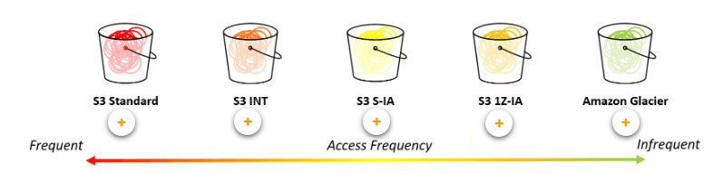

# Exam Readiness for MLE

A brief refresher into what will be tested. We have covered below a concise version of will be included and we need to know in depth:

---

## 1. Course Introduction

 

- Understand basic algorithms & hyper-parameter tuning.

- Understanding ML Pipeline.

- Experience with ML and Deep Learning frameworks.

- Understanding of and experience in model training, deployment & operational best practices.

- Use this guide as a starting point (or before exam) - to identify weaknesses and dig deeper.

 

## 2. Exam Overview and Test-Taking Strategies

 

- Focus on key phrases, and qualifier to easily discard distracting questions.

- Focus on AWS Services, and see if there is a correlation between the assumption and the service.

- Prepare for some minor calculations at hand.

- Read and understand the question before reading answer options (pretend the answer options aren't even there at first).

- Identify the key phrases and qualifiers in the question.

- Try to answer the question before even looking at the answer choices, then see if any of those answer choices match your original answer.

- Eliminate answer options based on what you know about the question, including the key phrases and qualifiers you highlighted earlier.

- If you still don't know the answer, consider flagging the question and moving on to easier questions. But remember to answer all questions before the time is up on the exam, as there are no penalties for guessing.

 

## 3. Domains Which Will Be Covered

 

### **Data Engineering**

 

- **Create data repositories for Machine Learning**.

  - Think of Data Lake as an all encompassing solution for ML tasks.

  - *Lake Formation* as a single place to manage access controls for data in your data lake

  - Recall storage solutions and use cases.

  - 

  - *Amazon FSx* for Lustre &rarr; for running training jobs several times using different algorithms and parameter (when data is already on S3).

  - If data is already in EFS &rarr; use that as training data source (faster training start times).

  - Images per second that each file system can load (Amazon FSx fastest &rarr; S3 slowest).

  - Topics to study in depth:

    - AWS Lake Formation &#x2610;

    - Amazon S3 (as storage for a data lake) &#x2610;

    - Amazon FSx for Lustre &#x2610;

    - Amazon EFS &#x2610;

    - Amazon EBS volumes &#x2610;

    - Amazon S3 lifecycle configuration &#x2610;

 

- **Identify and implement a data-ingestion solution**.

  - Batch vs Streaming Ingestion

  - Batch has the following attributes:

    - Cheaper, simpler method for periodically ingesting data.

    - Services which can enable batch ingestion:

      - AWS Glue (ETL Service).

      - AWS Database Migration Service (Reads  historical data from source systems, such as RDS, Warehouses, and NoSQL databases, at any desired interval).

      - AWS Step Functions (to automate the abovementioned).

  - Streaming has the following attributes:

    - Data is sourced, manipulated, and loaded as soon as it is created or recognized.

    - More expensive, harder to maintain.

    - The following services are associated with streaming data:

      - Kinesis Video Stream

      - Kinesis Data Analytics

      - Kinesis Firehose

      - Kinesis Data Stream

    - Topics to study more in depth:

      - Amazon Kinesis Data Streams &#x2610;

      - Amazon Kinesis Data Firehose &#x2610;

      - Amazon Kinesis Data Analytics &#x2610;

      - Amazon Kinesis Video Streams &#x2610;

      - AWS Glue &#x2610;

      - Apache Kafka &#x2610;

  - Identify and implement a data-transformation solution.

   

  ---

   

### **Domain 2: Exploratory Data Analysis**

 

- Sanitize and prepare data for modeling.

  - Multivariate statistics (correlation & relationships).

  - Attribute statistics (f.ex mean, SD).

  - Individual statistics (f.ex rows, columns).

  - Clean data

    - Same scale (f.ex miles vs km).

    - Columns dont have multiple features (f.ex date, text).

    - Clear Outliers.

    - Imputation & dealing with missing data.

  - Topics to study more:

    - Dataset generation

      - Amazon SageMaker Ground Truth

      - Amazon Mechanical Turk

      - Amazon Kinesis Data Analytics

      - Amazon Kinesis Video Streams

    - Data augmentation

    - Descriptive statistics

    - Informative statistics

    - Handling missing values and outliers

- **Perform feature engineering.**

  - Reduce features (PCA, t-distributed stochastic neighbor embedding).

  - For numerical we can transform (multiply, square, cube).

  - Categorical Feature Engineering:

    - Ordinal &rarr; ORDER MATTERS.

    - Nominal &rarr; ORDER DOESN'T MATTER.

  - Common techniques for scaling (clues in names):

    - Mean/variance standardization.

    - MinMax scaling.

    - Maxabs scaling.

    - Robust scaling.

    - Normalizer.

  - Topics to study:

    - Scaling.

    - Normalizing.

    - Dimensionality Reduction.

    - Date Formatting.

    - One-Hot Encoding.

 

### **Domain 3: Modeling**

 

- **Frame business problems as ML problems.**

  - Use ML, when?

    - If tons of data, and we can make prediction.

    - If we cannot code rules.

    - If we cannot scale current solution.

  - ML Algorithms:

    - Supervised:

      - Binary Classification.

      - Multiclass Classification.

      - Regression problems.

    - Unsupervised

    - Reinforcement

  - Topics to study:

    - Supervised learning

    - Regression and classification

    - Unsupervised learning

    - Clustering

    - Anomaly detection

    - Deep learning

    - Perceptron

    - Components of an artificial neuron

- **Select appropriate model(s) for given problem.**

- **Train ML models.**

  - Splitting data (train/test/val):
  
    - 80%:10%:10%. or 70%:15%:15%

    - Cross Validation (compare the performance of multiple models)

      - K-Fold (split the input data into k subsets of data).

  - Topics to study:

    - Amazon SageMaker workflow for training jobs.

    - Running a training job using containers.

    - Build your own containers.

    - P3 instances.

    - Components of an ML training job for deep learning.

   

- **Perform hyperparameter optimization.**

  - Different types of Hyperparameters:

    - Model Hyperparameters (filter size, pooling, architecture).

    - Optimizers (how model learns - Adagrad, Xavier Init etc.).

    - Data Hyperparameters (augementation - cropping, resizing).

  - Topics to study:

    - Amazon SageMaker hyperparameter tuning jobs

    - Common hyperparameters to tune

      - Momentum

      - Optimizers

      - Activation functions

      - Dropout

      - Learning rate

    - Regularization

      - Dropout

      - L1/L2

- **Evaluate ML Models.**

  - Confusion Matrix.

    - Accuracy (All trues / All) &rarr; dont use when we have many true negatives.

    - Precision (TP/ ALL Positives) &rarr; when cost of False positives is high (hiring for FAANG).

    - Recall (TP / TP + FN) &rarr; when cost of False negatives is high (customers for fraud, execution).

    - F1-Score

  - Topics to Study
  
    - Metrics for regression: sum of squared errors, RMSE

    - Sensitivity

    - Specificity

    - Neural network functions like Softmax for the last layer

 

### **Domain 4: ML Implementation and Operations**

 

- **Build ML solutions for performance, availability, scalability, resiliency and fault tolerance.**

  - Design for high-availability & fault tolerance:

    - High Availability &rarr; system will keep working even when some component in architecture stops working.

    - Fault Tolerance &rarr; ensures no degradation (despite failure in architecture).

    - Decoupling resources in a distributed fashion (f.ex storage & training jobs).

    - Use queues like Amazon SQS or Step Functions.

    - Monitor with CloudWatch (logs, alarms, events).

    - Use AWS CloudTrain to capture API calls, related events on behalf of AWS account (store in S3).

    - Common practices for designing for failure:

      - Decouple ETL process from ML pipeline (AWS GLUE & Amazon EMR) &rarr; use Apache Spark to handle large amounts.

      - Deploy Amazon Sagemakes Endpoints backed by multiple instances across availability zones.

      - Containerize ML models for both inference & training in Sagemaker.

      - Use AWS Auto-Scaling 

    - Topics to study in depth:

      - Amazon Deep Learning containers

      - AWS Deep Learning AMI (Amazon Machine Image)

      - AWS Auto Scaling

      - AWS GPU (P2 and P3) and CPU instances

      - Amazon CloudWatch

      - AWS CloudTrail

- **Recommend and implement the appropriate ML services and features for a given problem**.

- Topics to study more:

  - Amazon SageMaker Spark containers

  - Amazon SageMaker build your own containers

  - Amazon AI services 

    - Amazon Translate

    - Amazon Lex

    - Amazon Polly

    - Amazon Transcribe

    - Amazon Rekognition

    - Amazon Comprehend

- **Apply basic AWS security practices for ML solutions.**

  - IAM Role-Based Access (Least Privilige Access).

  - Launch Instances in customer managed VPC.

    - Specify subnets & security groups (creates elastic network interfaces associated with them).

  - Encrypt data at rest with SageMaker with AWS KMS (create, import, rotate, disable, delete, define usage policies for, and audit the use of encryption keys).

  - Ways to manage AWS KMS with Amazon S3:

    - 

- **Deploy and operationalize ML solutions.**AWS CloudTrail
