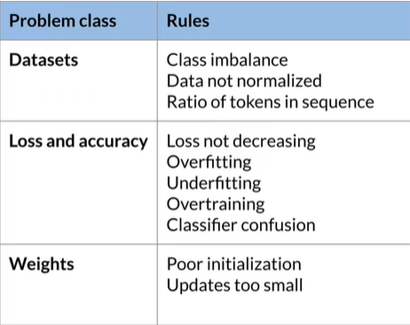

# **[Practical Data Science on the AWS Cloud Specialization](https://www.coursera.org/specializations/practical-data-science)**

Summary of the Coursera Series. Composed of three parts:

- Analyze Datasets and Train ML Models using AutoML.

- Build, Train, and Deploy ML Pipelines using BERT.

- Optimize ML Models and Deploy Human-in-the-Loop Pipelines.

***Highly recommended to do the hands on lab!***

 

## Analyze Datasets and Train ML Models using AutoML

 

- Focus on massive data which cannot be run locally. (Elastic **pay-as-you** go infrastructure).

- Ingest and analyze data:

  - Data Exploration & Bias Detection:

    - Amazon S3 & Amazon Athena.

      - **Athena** &rarr; serverless running SQL queries (petabytes). No data movement required.

    - Amazon Glue.

      - **Glue Catalog** &rarr; creates reference s3 to data mapping. (Metadata about schema etc.)

      - **Glue Crawler** &rarr; automatically infers data schema and updates data catalog.

    - Sagemaker (Data Wrangler, Clarify).

      - **Data Wrangler** &rarr; can ingest data from data lakes, warehouses, databases.

- Prepare & transform:

  - Feature Engineering and Feature Store:

    - Sagemaker **Data Wrangler**.

    - Sagemaker **Feature Store**.

    - Sagemaker **Processing Jobs**.

- Train & Tune:

  - Automated ML & Model Train/Tune

    - Sagemaker **Autopilot**.

    - Sagemaker **Training & Debugger**.

    - Sagemaker **Hyperparameter Tuning**.

- Deployment & Production:

  - Model Deployment & Automated Pipelines

    - Sagemaker **Endpoints**.

    - Sagemaker **Batch Transform**.

    - Sagemaker **Pipelines**.

- Typical ML workflow and tools:

- Statistical bias and feature importance:

  - **Statistical Bias**: Tendency to *overestimate/underestimate* a parameter.

  - Biased datasets &rarr; biased models. F.ex vastly more product reviews for A then B.

  - Different Types of Biases:

    - **Activity** Bias (f.ex popularity of product B than A).

    - **Social** Bias (f.ex preconceived notions about background).

    - **Selection** Bias (f.ex streaming movie recommendation wolves vs favorite actors).

  - Data Drifts types (data distribution significantly varies from ):

    - *Covariant Drift* &rarr; distribution of features changes.

    - *Prior probability Drift* &rarr; distribution of target variable changes.

    - *Concept Drift* &rarr; relationship between both changes (f.ex age, geography location).

  - *Class Imbalance* &rarr; (Disproportionate reviews)?

  - *DPL* - *Difference in Proportions of Labels* (imbalance between positive outcomes). F.ex way higher ratings?

- Main service to use: **Sagemaker Clarify** (import as library). bias config &rarr; run_pre_training_bias

  - **Bias** Detection

  - ML **explainability**

  - **Report** generation

- Detecting statistical biases:

  - Sagemaker Data Wrangler &rarr; UI Based flow; launch bias detection.

  - Sagemaker Clarify &rarr; API based approach, ability to scale (processing jobs distributed).

- Feature Importance:

  - **SHAP** &rarr; game theory approach; multiplayer game where *outcome of the play is ML prediction*. (Local & Global).

  - Analysis &rarr; Data Wrangler can create *feature importance reports*.

- **Auto-ML**

  - Reduce Time-to-Market.

  - Iterate quickly using ML and automation.

  - Lower ML barrier to entry for non Data Scientists.

  - Save scarce resources for more vital use cases.
  
  - Fully transparent. Walks you through data processing, modeling etc.

  

  - Can be fully managed, or until feature engineering.

  - Visibility in optimized in hyper-parameter tuning:

  

- Model Hosting:
  
  - Batch & Real-Time Deployment:

    - Multiple Containers (Pipeline Model):

      - *Data transformation* container.

      - *Algorithm* Container.

      - *Inverse Label* Transformer Container.

  - *Inference* Pipeline.

- **Built-in algorithms**

  - Choose built-in algorithms when:

    - When we need highly optimized and scalable solutions.

    - Generalized solutions without much customization.

    - Built-in vs Bring Code vs Bring Containers.

 

---

 

## Build, Train, and Deploy ML Pipelines using BERT

 

- Feature Engineering (Main Steps):

  - **Feature Selection** &rarr; reduce dimensionality for faster training.

    - Feature selection *score* through **Data Wrangler**

     

  - **Feature Creation** &rarr; combine new features or infer new attributes to increase accuracy of predictions.

  - **Feature Transformation** &rarr; imputing, scaling or transforming.

- Feature Engineering Pipeline:

  - Select Features & Labels (Input of Raw Data)

  - Balance Dataset by Label

  - Split Dataset

  - Transform (Output of Features to be used for Training)

 

- BERT

  - Based on Transformer Architecture.

  - Operates on Sentence Level.

  - Using Bi-Directional form, it can capture context.

  - RoBERTa - A Robustly Optimized BERT Pretraining Approach

  - Potential Challenge: Using feature engineering at scale!

- Sagemaker Processing

  - Performs preprocessing, postprocessing & data evaluation at scale.

  - Can scale through distributed clusters.

  - Built-in Sklearn container.

- Feature Store

  - Repository to store engineered features.

  - Centralized (many people can contribute).

  - Reusable (can be used in multiple projects).

  - Discoverable (so that people can easily access it).

  - Can be retrained, and deleted after training.

- Sagemaker Feature Store

  - Centralized repository for depositing features.

  - Easily scalable.

  - Real-time & batch ability to lookup up features.

 

- Model Training & Tuning

  - Using pre-trained models, helps reduce training time & costs (adapting to our use case).

  - Built-in vs Pre-Trained Difference (Code vs Model)

- Sagemaker Jumpstart

  - Has pre-trained models from TensorFlow Hub & PyTorch Hub.

  - Lets us deploy and/or fine-tune (NLP, CV etc.) in one click.

- Storing training images

  - Configure dataset & evaluation metrics.

    - Train/Test/Val Split

    - Use Sagemaker Training Input to configure data input flow, for the training.

    - Use CloudWatch to define RegEx expressions to capture the evaluation metrics.

  - Evaluation Metrics (Validation Loss VS Validation Accuracy)

  - Configure hyper-parameters.

    - Number of Epochs, learning rate etc.

   

  - Provide training script.

    - Importing transformers, model configurations, model name, train model.

  - Fit the model.

    - Import Sagemaker PytorchEstimator.

    - Add requirements & instance types.

    - Pass defined hyperparameters.

    - Add estimator.fit.

  
  

- Debugging & Profiling

  - Common training errors:

    - Vanishing Gradients &rarr; When there are more layers in the network, the value of the product of derivative decreases until at some point the partial derivative of the loss function approaches a value close to zero, and the partial derivative vanishes

    - Exploding Gradients &rarr; the inverse of the vanishing gradient and occurs when large error gradients accumulate, resulting in extremely large updates to neural network model weights during training. As a result, the model is unstable and incapable of learning from your training data.

    - Bad Initialization &rarr; issues when we have same initialization values, too small, or too big init values lead to vanishing/exploding.

    - Overfitting/Underfitting.

  - System resources issues (bottlenecks):

    - I/O usage (for loading data)

    - CPU & Memory Usage (when processing data)

    - GPU Usage (training data)

- Sagemaker Debugger

  - Monitors & profiles system resources (CPU, GPU, network, memory) in real time.

  - Given recommendations on reallocation of resources.

  - Captures debugging metrics (data, framework, output tensors etc.)

 

- Debugger Building Rules (Import rules & rules_config).

 

- MLOps

  - Different from Software Development Lifecycle

    - Additional Pipeline tasks (new data generated).

    - Considerations (People, Tech, Process).

     

- Best practice for MLOps:

  - Use Data Lakes.

  - Enable Traceability (Code Versioning & Data Versioning).

  - Pipeline Checks (Bias, Schema, Quality)